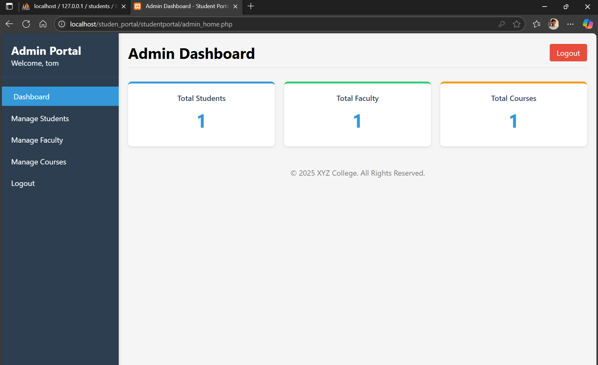

# 🎓 Student Portal Management System

A comprehensive web-based student portal management system built with PHP, MySQL, and modern CSS. This system provides complete management of students, faculty, courses, and academic records.

## 📸 Screenshots


### 🏠 **Admin Dashboard**

*Admin Gateway – Manage students, faculty, and courses with full CRUD operations.*

### 👨‍🏫 **Faculty Management**

*Faculty Gateway – Add student attendance, marks, reviews, and more.*

### 👨‍🎓 **Student Portal**

*Student Gateway – View marks, attendance, and register for exams.*

### 📚 **Course Management**

*Create and manage academic courses and programs*

## ✨ Features


### 👨‍💼 Admin Gateway
- **Admin Home Page** with centralized control
- **Add Student**: Create and manage student records
- **Add Faculty**: Create and manage faculty records
- **Add Course**: Create and manage course details
- **CRUD Operations**: Perform full database operations on all records

### 👨‍🏫 Faculty Gateway
- **Faculty Home Page**
- **Add Attendance**: Record student attendance
- **Add Marks**: Enter and update student marks
- **Add Reviews**: Provide feedback and comments for students
- **Other Academic Updates**: Manage additional student-related information

### 👨‍🎓 Student Gateway
- **View Marks**: Check academic performance
- **View Attendance**: Track attendance records
- **Exam Registration**: Register for upcoming examinations

## 📋 Prerequisites

Before running this project, make sure you have:

- **XAMPP** (Apache + MySQL + PHP) or **WAMP** server
- **PHP 7.4** or higher
- **MySQL 5.7** or higher
- **Web browser** (Chrome, Firefox, Safari, Edge)

## 🚀 Installation

### Step 1: Download/Clone
```bash
# Clone the repository
git clone https://github.com/manukrishna804/studentportal.git

# Or download ZIP and extract to your web server directory
```

### Step 2: Setup Web Server
1. **Install XAMPP** from [https://www.apachefriends.org/](https://www.apachefriends.org/)
2. **Start XAMPP Control Panel**
3. **Start Apache and MySQL services**

### Step 3: Database Setup
1. **Open phpMyAdmin**: `http://localhost/phpmyadmin`
2. **Create new database**: `students`
3. **Import database**: Use the `students.sql` file provided

### Step 4: Project Setup
1. **Copy project files** to: `C:\xampp\htdocs\studentportal\`
2. **Verify file structure**:
   ```
   htdocs/studentportal/
   ├── admin_login.php
   ├── add_faculty.php
   ├── login1.php
   ├── students.sql
   └── ... (other files)
   ```

### Step 5: Test Installation
1. **Open browser**: `http://localhost/studentportal/`
2. **Test PHP**: `http://localhost/studentportal/php_test.php`
3. **Admin Login**: `http://localhost/studentportal/admin_login.php`

## 🔐 Default Login Credentials

### Admin Access
- **Username**: Check your `students.sql` file for admin credentials
- **Password**: Check your `students.sql` file for admin credentials

### Faculty Access
- Faculty accounts are created by admin
- Each faculty member gets unique login credentials

### Student Access
- Student accounts are created by admin
- Each student gets unique login credentials

## 📁 Project Structure

```
studentportal/
├── admin_login.php          # Admin authentication
├── admin_home.php           # Admin dashboard
├── add_faculty.php          # Add new faculty
├── manage_faculty.php       # Faculty management
├── add_course.php           # Add new course
├── manage_course.php        # Course management
├── add-student-details.php  # Add new student
├── manage_students.php      # Student management
├── faculty_login.php        # Faculty authentication
├── faculty_home.php         # Faculty dashboard
├── student_login.php        # Student authentication
├── student-home.php         # Student dashboard
├── login1.php               # Database connection
├── students.sql             # Database structure
├── style.css                # Main stylesheet
├── admin-style.css          # Admin module styles
├── add-faculty.css          # Faculty form styles
├── add-course.css           # Course form styles
└── README.md                # This file
```

## 🎯 Usage Guide

## 🎬 **Demo & Walkthrough**


### **Database Structure**

*MySQL database schema and relationships*

### For Administrators
1. **Login** using admin credentials
2. **Add Faculty**: Create new faculty accounts
3. **Add Students**: Register new students
4. **Add Courses**: Create course offerings
5. **Manage Records**: Update and delete information

### For Faculty
1. **Login** using faculty credentials
2. **View Students**: Access student information
3. **Record Attendance**: Track student attendance
4. **Update Marks**: Record academic performance
5. **Add Remarks**: Provide student feedback

### For Students
1. **Login** using student credentials
2. **View Profile**: Access personal information
3. **Check Attendance**: Monitor attendance records
4. **View Marks**: Check academic performance
5. **Register Courses**: Enroll in available courses

## 🔧 Troubleshooting

### Common Issues

#### PHP Not Processing
- **Symptom**: See PHP source code instead of output
- **Solution**: Ensure Apache and PHP are running in XAMPP

#### Database Connection Failed
- **Symptom**: "Connection failed" error
- **Solution**: Start MySQL service in XAMPP

#### Page Not Found
- **Symptom**: 404 error
- **Solution**: Check file location in `htdocs/studentportal/`

#### Styling Issues
- **Symptom**: Pages look unstyled
- **Solution**: Verify CSS files are in correct location

### Debug Tools
- **PHP Test**: `http://localhost/studentportal/php_test.php`
- **Connection Test**: `http://localhost/studentportal/test_connection.php`
- **Integration Fix**: `http://localhost/studentportal/fix_integration_issues.php`

## 🚨 Security Features

- **Session Management**: Secure user authentication
- **SQL Injection Prevention**: Prepared statements
- **Input Validation**: Data sanitization and validation
- **Access Control**: Role-based permissions
- **Secure Logout**: Proper session termination

## 📱 Browser Compatibility

- ✅ Chrome 80+
- ✅ Firefox 75+
- ✅ Safari 13+
- ✅ Edge 80+
- ✅ Internet Explorer 11+

## 🤝 Contributing

1. **Fork** the repository
2. **Create** a feature branch (`git checkout -b feature/AmazingFeature`)
3. **Commit** your changes (`git commit -m 'Add some AmazingFeature'`)
4. **Push** to the branch (`git push origin feature/AmazingFeature`)
5. **Open** a Pull Request


## 👨‍💻 Author

**Your Name**
- GitHub: [manukrishna804](https://github.com/manukrishna804)
- Email: manukrishna804@gmail.com

## 🙏 Acknowledgments

- **XAMPP** for the development environment
- **PHP Community** for excellent documentation
- **MySQL** for robust database management
- **Open Source Community** for inspiration and tools

## 📞 Support

If you encounter any issues or have questions:

1. **Check** the troubleshooting section above
2. **Search** existing GitHub issues
3. **Create** a new issue with detailed description
4. **Contact** the author directly

---

## ⭐ Star This Repository

If this project helped you, please give it a ⭐ star on GitHub!

---

**Happy Coding! 🎉**
